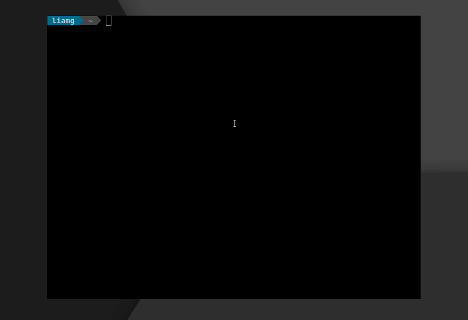

# gitjacker

[](https://travis-ci.org/liamg/gitjacker)

Gitjacker downloads git repositories and extracts their contents from sites where the `.git` directory has been mistakenly uploaded. It will still manage to recover a significant portion of a repository even where directory listings are disabled.

For educational/penetration testing use only.

More information at [https://liam-galvin.co.uk/security/2020/09/26/leaking-git-repos-from-misconfigured-sites.html](https://liam-galvin.co.uk/security/2020/09/26/leaking-git-repos-from-misconfigured-sites.html)



## Installation

```bash
curl -s "https://raw.githubusercontent.com/liamg/gitjacker/master/scripts/install.sh" | bash
```

...or grab a [precompiled binary](https://github.com/liamg/gitjacker/releases).

You will need to have `git` installed to use Gitjacker.

## In The News
- 20/06/21: [Console 58](https://console.substack.com/p/console-58) - Awesome newsletter featuring tools and beta releases for developers.
- 19/10/20: [ZDNet Article](https://www.zdnet.com/article/new-gitjacker-tool-lets-you-find-git-folders-exposed-online/) - *New Gitjacker tool lets you find .git folders exposed online*
